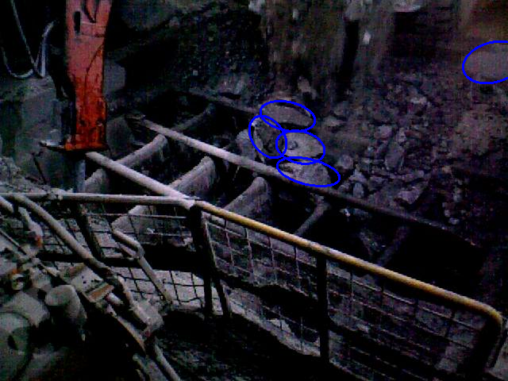
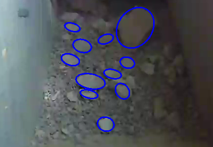

# Detecting Rocks in Challenging Mining Environments using Convolutional Neural Networks and Ellipses as an alternative to Bounding Boxes

## Abstract

The automation of heavy-duty machinery and vehicles used in underground mines is a growing tendency which requires addressing several challenges, such as the robust detection of rocks in the production areas of mines. For instance, human assistance must be requested when using autonomous LHD (Load-Haul-Dump) loaders in case rocks are too big to be loaded into the bucket. Also, in the case of autonomous rock breaking hammers, oversized rocks need to be identified and located, to then be broken in smaller sections. In this work, a novel approach called Rocky-CenterNet is proposed for detecting rocks. Unlike other object detectors, Rocky-CenterNet uses ellipses to enclose a rock’s bounds, enabling a better description of the shape of the rocks than the classical approach based on bounding boxes. The performance of Rocky-CenterNet is compared with the one of CenterNet and Mask R-CNN, which use bounding boxes and segmentation masks, respectively. The comparisons were performed on two datasets: the Hammer-Rocks dataset (introduced in this work) and the Scaled Front View dataset. The Hammer-Rocks dataset was captured in an underground ore pass, while a rock-breaking hammer was operating. This dataset includes challenging conditions such as the presence of dust in the air and occluded rocks. The metrics considered are related to the quality of the detections and the processing times involved. From the results, it is shown that ellipses provide a better approximation of the rocks shapes’ than bounding boxes. Moreover, when rocks are annotated using ellipses, Rocky-CenterNet offers the best performance while requiring shorter processing times than Mask-RCNN (4x faster). Thus, using ellipses to describe rocks is a reliable alternative.

## Highlights:
- A detector named Rocky-CenterNet is proposed that detects rocks as ellipses
- Rocky-CenterNet runs 4x faster than Mask R-CNN
- Rocky-CenterNet is a suitable alternative for mining applications

## Main results

Evaluation for Rocky-CenterNet was done with the flip_text flag on (meaning both the original image and horizontally flipped images outputs are averaged and used), while Rocky-CenterNet's metrics were obtained conventionally, as no benefit was obtained using test augmentation in inference.

(RockyCN stands for Rocky-CenterNet while CN stands for CenterNet)

### Rock Detection on Hammer Rock Test Set

|  Metric      |RockyCN vs - polygon| CN vs - polygon  |RockyCN vs - ellipse|  CN  vs - bbox   |
|--------------|--------------------|------------------|--------------------|------------------|
|AP (all)      |       59.5         |       51.1       |       73.2         |       76.2       |
|AP (small)    |       61.4         |       50.1       |       73.1         |       73.6       |
|AP (medium)   |       60.1         |       52.2       |       75.5         |       76.2       |
|AP (large)    |       60.3         |       51.8       |       73.8         |       78.6       |
|AR (all)      |       66.0         |       57.2       |       79.3         |       81.9       |
|AR (small)    |       64.4         |       56.3       |       79.3         |       82.5       |
|AR (medium)   |       66.6         |       57.4       |       80.8         |       81.0       |
|AR (large)    |       66.5         |       57.6       |       77.5         |       82.7       |

### Rock Detection on Scaled Front Dataset

|  Metric      |RockyCN vs - ellipse|  CN vs - ellipse   | RockyCN vs - bbox  |  CN  vs - bbox   |
|--------------|--------------------|--------------------|--------------------|------------------|
|AP (all)      |       58.8         |       54.9         |       59.8         |       66.0       |
|AP (small)    |       56.9         |       52.0         |       58.0         |       62.2       |
|AP (medium)   |       66.8         |       61.8         |       67.7         |       73.9       |
|AP (large)    |       88.3         |       62.8         |       88.3         |       88.0       |
|AR (all)      |       65.3         |       61.8         |       67.1         |       73.1       |
|AR (small)    |       64.1         |       60.2         |       66.0         |       71.1       |
|AR (medium)   |       70.8         |       66.6         |       72.3         |       78.2       |
|AR (large)    |       90.0         |       65.2         |       90.0         |       88.9       |

All models and details are available in our [Model zoo](readme/MODEL_ZOO.md).

## Installation

Please refer to [INSTALL.md](readme/INSTALL.md) for installation instructions.

## Use Rocky-CenterNet

You can demo rock detection on images.

First, download the models (By default, [rockdet_coco_dla_2x](https://drive.google.com/file/d/15EkBUSIB_mDNhkXTHLzLJdrM_2azG1Am/view?usp=sharing) for detection with ellipses, or [ctdet_coco_dla_2x](https://drive.google.com/file/d/1t2OrQWuilNepO2LCcMH694Sc5-VhtyqO/view?usp=sharing) for detection with bounding boxes, from the [Model zoo](readme/MODEL_ZOO.md) and put them in `Rocky-CenterNet_ROOT/models/`.

For object detection on images, run:

~~~
python demo.py rockdet --demo /path/to/image/or/folder/or/video --load_model ../models/rockdet_rock_coco_dla_2x.pth
python demo.py ctdet --demo /path/to/image/or/folder/or/video --load_model ../models/ctdet_rock_coco_dla_2x.pth
~~~
We provide example images in images (from the [Scaled Front Dataset and Hammer Rocks Dataset](http://datos.uchile.cl/dataset.xhtml?persistentId=doi:10.34691/FK2/1GQBHK)). If set up correctly, the output should look like

   

To use this Rocky-CenterNet in your own project, you can

~~~
import sys
ROCKYCENTERNET_PATH = /path/to/Rocky-CenterNet/src/lib/
sys.path.insert(0, ROCKYCENTERNET_PATH)

from detectors.detector_factory import detector_factory
from opts import opts

MODEL_PATH = /path/to/model
TASK = 'rockdet' # or 'ctdet' for detection with bounding-boxes
opt = opts().init('{} --load_model {}'.format(TASK, MODEL_PATH).split(' '))
detector = detector_factory[opt.task](opt)

img = image/or/path/to/your/image/
ret = detector.run(img)['results']
~~~
`ret` will be a python dict: `{category_id : [[xc, yc, a, b, ang, score], ...], }` (rockdet task) or `{category_id : [[x1, y1, x2, y2, score], ...], }` (ctdet task)

## Benchmark Evaluation and Training

After [installation](readme/INSTALL.md), follow the instructions in [DATA.md](readme/DATA.md) to setup the datasets. Then check [GETTING_STARTED.md](readme/GETTING_STARTED.md) to reproduce the results in the paper. You can also view our test capsule in [CodeOcean](https://codeocean.com/capsule/1939158/tree).

## License

Rocky-Centernet itself is released under the MIT License (refer to the LICENSE file for details), as is the base Centernet project this repository is based on. The code is heavily base on the original [CenterNet](https://github.com/xingyizhou/CenterNet) project, which itself borrows code from [human-pose-estimation.pytorch](https://github.com/Microsoft/human-pose-estimation.pytorch) (image transform, resnet), [CornerNet](https://github.com/princeton-vl/CornerNet) (hourglassnet, loss functions), [dla](https://github.com/ucbdrive/dla) (DLA network), [DCNv2](https://github.com/CharlesShang/DCNv2)(deformable convolutions), [tf-faster-rcnn](https://github.com/endernewton/tf-faster-rcnn)(Pascal VOC evaluation) and [kitti_eval](https://github.com/prclibo/kitti_eval) (KITTI dataset evaluation). Please refer to the original License of these projects (See [NOTICE](NOTICE)).

### Citation

If you find this project useful for your research, please use the following BibTeX entry.

    @article{loncomilla2022detecting,
      title={Detecting Rocks in Challenging Mining Environments using Convolutional Neural Networks and Ellipses as an alternative to Bounding Boxes},
      author={Loncomilla, Patricio and Samtani, Pavan and Ruiz-del-Solar, Javier},
      journal={Expert Systems with Applications},
      publisher={Elsevier},
      year={2022}
    }

## Repository forked from: Objects as Points
Object detection, 3D detection, and pose estimation using center point detection:
> [**Objects as Points**](http://arxiv.org/abs/1904.07850),            
> Xingyi Zhou, Dequan Wang, Philipp Kr&auml;henb&uuml;hl,        
> *arXiv technical report ([arXiv 1904.07850](http://arxiv.org/abs/1904.07850))*
> Github(https://github.com/xingyizhou/CenterNet)      

Contact: [zhouxy@cs.utexas.edu](mailto:zhouxy@cs.utexas.edu).
